# 数据库表 GDPR 数据清理顺序 (Phase 9 Delete Order)

本文件详细记录了当接收到 `APP_UNINSTALLED` (应用卸载) 或 `SHOP_REDACT` (店铺数据删除) GDPR 请求时，清理关联该店铺的数据库记录的安全、无冲突删除顺序。该顺序由数据库表的外键层级依赖分析推导得出，通过先清除最深层子表，最后清除主表来防止破坏外键完整性约束。

## 完整删除链路依赖图

```mermaid
graph TD
    audit_log["audit_log (审计日志)"] --> job_item["job_item (作业明细)"]
    job_item --> alt_draft["alt_draft (生成草稿)"]
    alt_draft --> decorative_mark["decorative_mark (装饰标记)"]
    decorative_mark --> candidate_group_projection["candidate_group_projection (分组投影)"]
    candidate_group_projection --> alt_candidate["alt_candidate (候选Alt)"]
    alt_candidate --> image_usage["image_usage (图片使用)"]
    image_usage --> alt_target["alt_target (Alt目标)"]
    alt_target --> scan_result_usage["scan_result_usage (扫描结果使用)"]
    scan_result_usage --> scan_result_target["scan_result_target (扫描结果目标)"]
    scan_result_target --> stg_product["stg_product (暂存产品)"]
    stg_product --> stg_media_image_product["stg_media_image_product (暂存媒体)"]
    stg_media_image_product --> stg_media_image_file["stg_media_image_file (暂存文件)"]
    stg_media_image_file --> stg_collection["stg_collection (暂存集合)"]
    stg_collection --> stg_article["stg_article (暂存文章)"]
    stg_article --> scan_task_attempt["scan_task_attempt (扫描尝试)"]
    scan_task_attempt --> scan_task["scan_task (扫描任务)"]
    scan_task --> scan_job["scan_job (扫描作业)"]
    scan_job --> credit_ledger["credit_ledger (额度流水)"]
    credit_ledger --> credit_reservation_line["credit_reservation_line (保留明细)"]
    credit_reservation_line --> credit_reservation["credit_reservation (额度保留)"]
    credit_reservation --> credit_bucket["credit_bucket (额度桶)"]
    credit_bucket --> billing_ledger["billing_ledger (账单流水)"]
    billing_ledger --> overage_pack_purchase["overage_pack_purchase (超额包)"]
    overage_pack_purchase --> billing_subscription["billing_subscription (账单订阅)"]
    billing_subscription --> webhook_events["webhook_events (网络钩子事件)"]
    webhook_events --> job_batch["job_batch (作业批次)"]
    job_batch --> generation_batch["generation_batch (生成批次)"]
    generation_batch --> ai_model_call["ai_model_call (模型调用)"]
    ai_model_call --> resource_image_fingerprint["resource_image_fingerprint (指纹)"]
    resource_image_fingerprint --> shop_operation_lock["shop_operation_lock (操作锁)"]
    shop_operation_lock --> scan_notice_ack["scan_notice_ack (通知确认)"]
    scan_notice_ack --> Session["Session (会话表)"]
    Session --> shops["shops (店铺表)"]
```

## 逐表删除顺序详解 (最深子表 → 主表)

为了保证性能与防止高并发下的死锁，对每一张表均执行分批删除句式，循环直到返回影响行数小于 1000：

1. **`audit_log`** (审计日志)
   - 关联字段：`shop_id`
   - 说明：包含许多外键关联，必须最先移除。
2. **`job_item`** (作业明细)
   - 关联字段：无直接 `shop_id`，使用外键子查询 `"batch_id" IN (SELECT "id" FROM "job_batch" WHERE "shop_id" = $1)`
   - 说明：作业批次的子行，优先于草稿和批次删除。
3. **`alt_draft`** (生成草稿)
   - 关联字段：`shop_id`
4. **`decorative_mark`** (装饰标记)
   - 关联字段：`shop_id`
5. **`candidate_group_projection`** (分组投影)
   - 关联字段：`shop_id`
6. **`alt_candidate`** (候选Alt)
   - 关联字段：`shop_id`
7. **`image_usage`** (图片使用)
   - 关联字段：`shop_id`
8. **`alt_target`** (Alt目标)
   - 关联字段：`shop_id`
9. **`scan_result_usage`** (扫描结果使用)
   - 关联字段：`shop_id`
10. **`scan_result_target`** (扫描结果目标)
    - 关联字段：`shop_id`
11. **`stg_product`** (暂存产品)
    - 关联字段：`shop_id`
12. **`stg_media_image_product`** (暂存媒体图片)
    - 关联字段：`shop_id`
13. **`stg_media_image_file`** (暂存媒体文件)
    - 关联字段：`shop_id`
14. **`stg_collection`** (暂存集合)
    - 关联字段：`shop_id`
15. **`stg_article`** (暂存文章)
    - 关联字段：`shop_id`
16. **`scan_task_attempt`** (扫描任务尝试)
    - 关联字段：`shop_id`
17. **`scan_task`** (扫描任务)
    - 关联字段：`shop_id`
18. **`scan_job`** (扫描作业)
    - 关联字段：`shop_id`
19. **`credit_ledger`** (额度流水)
    - 关联字段：`shop_id`
20. **`credit_reservation_line`** (保留明细)
    - 关联字段：`shop_id`
21. **`credit_reservation`** (额度保留)
    - 关联字段：`shop_id`
22. **`credit_bucket`** (额度桶)
    - 关联字段：`shop_id`
23. **`billing_ledger`** (账单流水)
    - 关联字段：`shop_id`
24. **`overage_pack_purchase`** (超额包购买)
    - 关联字段：`shop_id`
25. **`billing_subscription`** (账单订阅)
    - 关联字段：`shop_id`
26. **`webhook_events`** (网络钩子事件)
    - 关联字段：使用 domain 过滤 `"shop_domain" = $2`
27. **`job_batch`** (作业批次)
    - 关联字段：`shop_id`
28. **`generation_batch`** (生成批次)
    - 关联字段：`shop_id`
29. **`ai_model_call`** (AI模型调用)
    - 关联字段：`shop_id`
30. **`resource_image_fingerprint`** (图片指纹)
    - 关联字段：`shop_id`
31. **`shop_operation_lock`** (操作锁)
    - 关联字段：无 `id` 主键，直接按 `shop_id = $1` 清理
32. **`scan_notice_ack`** (通知确认)
    - 关联字段：`shop_id`
33. **`Session`** (会话表)
    - 关联字段：使用 domain 过滤 `"shop" = $2`
34. **`shops`** (主表店铺记录)
    - 关联字段：`id = $1`
